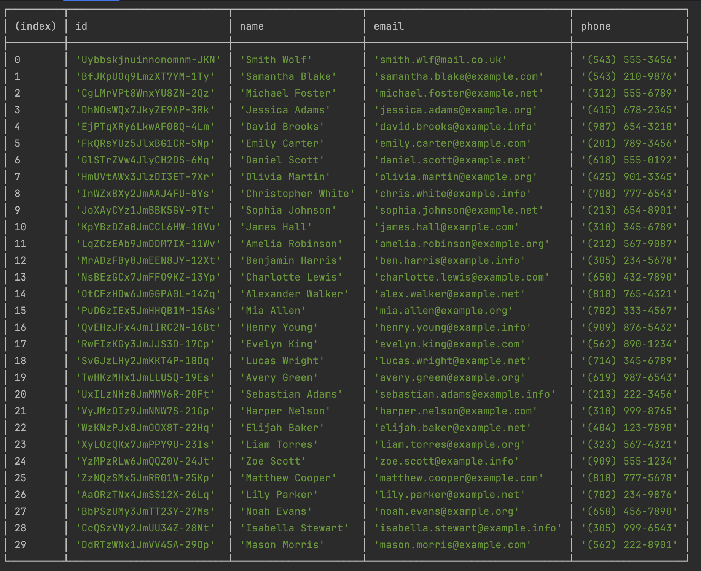
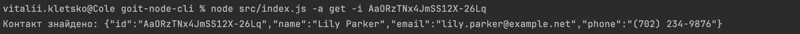
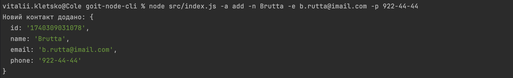
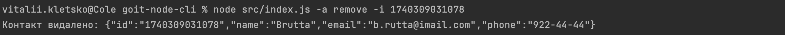

# goit-node-cli

### Fullstack. Back End Development: Node.js

### Master of degree from university

### Result of execution of the program
#### Full List of contacts

#### Get contact by id

#### Add new contact

#### Remove contact
